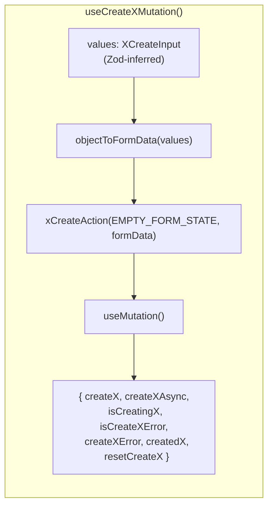
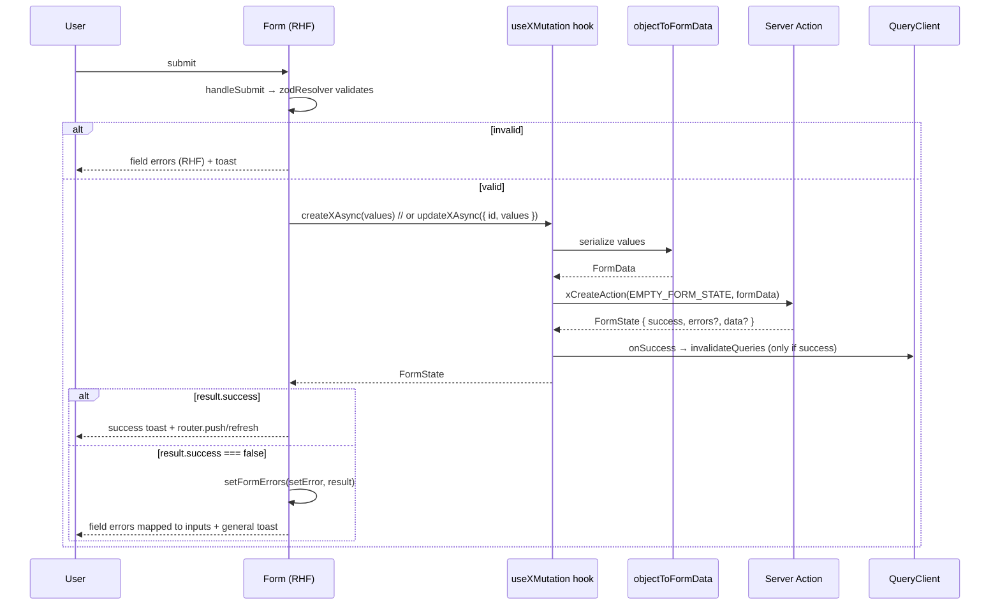
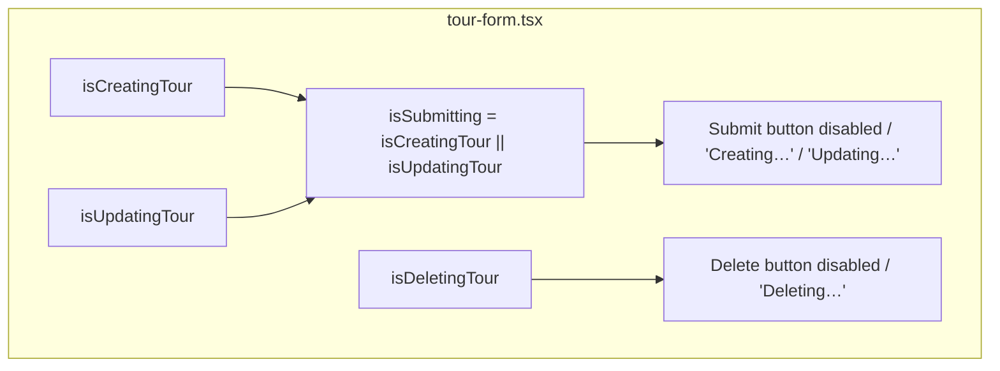
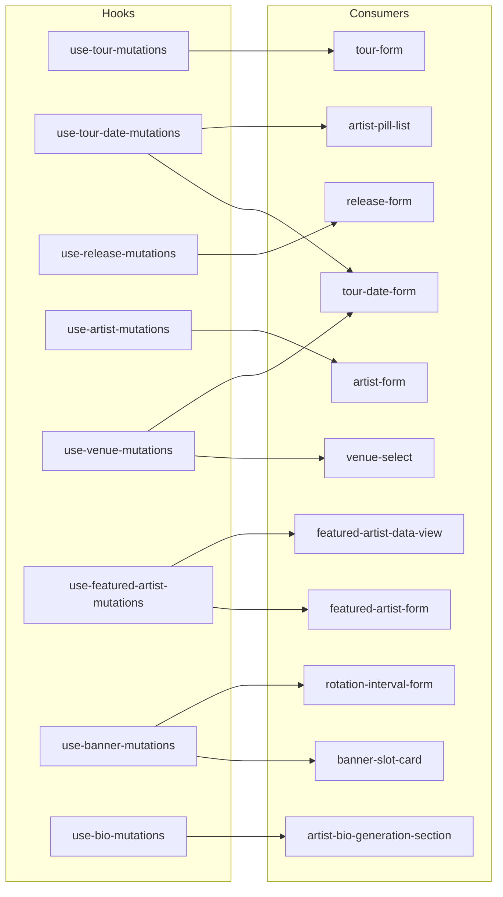

<!-- This Source Code Form is subject to the terms of the Mozilla Public
     License, v. 2.0. If a copy of the MPL was not distributed with this
     file, You can obtain one at https://mozilla.org/MPL/2.0/. -->

# Mutation hooks ↔ forms workflow

How the admin forms talk to the custom TanStack Query mutation hooks
(`src/app/hooks/mutations/`), the shared form utilities, and the Server Actions
after the "idiomatic mutation hooks" refactor.

## 1. The contract at a glance

Each form-backed hook now **accepts validated Zod values**, serializes them to
`FormData` internally, and **returns destructured, renamed props** instead of the
raw `useMutation` object.

- **Input** — `XCreateInput` for create, `{ id, values: XUpdateInput }` for update.
- **`objectToFormData`** (`src/lib/utils/forms/object-to-form-data.ts`) — skips
  `null`/`undefined`; omits empty strings (create) or keeps them (`keepEmptyStrings`
  for update flows that clear fields); JSON-encodes arrays, or appends each item
  individually for keys in `repeatKeys` (e.g. featured-artist `artistIds`).
- **`EMPTY_FORM_STATE`** (`src/lib/types/form-state.ts`) — the actions ignore the
  initial state, so one shared empty value replaces every hand-built `formState`.
- **Output** — named props; multiple hooks read cleanly side by side
  (`isCreatingTour || isUpdatingTour`).

## 2. Submit sequence (create / update form)

`setFormErrors` (`src/lib/utils/forms/set-form-errors.ts`) maps
`FormState.errors` onto RHF via `setError(field, { type: 'server', message })`
and returns the reserved `general` message for the caller to toast.

## 3. Pending state wiring

Forms read the hook's renamed pending flags directly instead of a local
`useState`/`useActionState`.

Image-heavy forms (artist, release) compose the hook flag with their own
transition/upload state:
`isSubmitting = isCreatingX || isUpdatingX || isTransitionPending || isUploadingImages`.

## 4. Hook ↔ consumer map

## 5. Serialization specifics (why per-form, not one rule)

The Server Actions are unchanged, so each hook's serializer must reproduce the
encoding its action already parses:

| Hook / field                                            | Encoding                                | Decoded by                    |
| ------------------------------------------------------- | --------------------------------------- | ----------------------------- |
| most string fields                                      | `String(value)`                         | `getActionState`              |
| numbers / booleans                                      | `String(value)` (coerced back)          | `getActionState`              |
| tour-date `headlinerIds`, release `formats`/`artistIds` | `JSON.stringify`                        | `getActionState` (`[`-prefix) |
| featured-artist `artistIds`                             | repeated `append` (`repeatKeys`)        | `payload.getAll('artistIds')` |
| update flows that clear                                 | empty strings kept (`keepEmptyStrings`) | action overwrites with `''`   |

Notes:

- **tour update** keeps empty strings (clears optional fields); **artist/release
  update** omit them (preserving prior behavior — they do not clear via blanks).
- **banner-slot-card** builds the typed object from controlled local state inside
  its `useActionState` action; the schema's `preprocess` maps `''`/absent → `null`.
- **featured-artist edit** still uses the PATCH API route (no update hook exists);
  only create + cover-art go through hooks.
